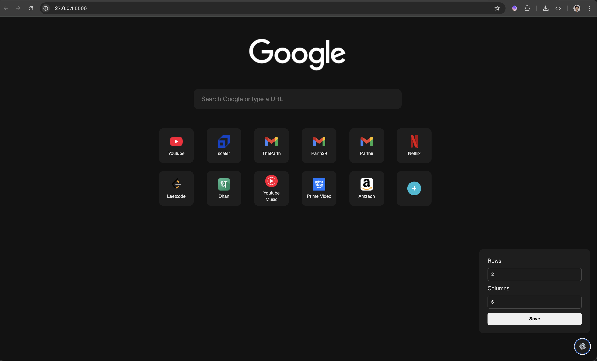

# 🔗 Unlimited Shortcuts - Chrome New Tab Extension

A sleek custom **New Tab page** that lets you add **unlimited shortcuts** — without clutter or limits.

## ✨ Motivation

Google Chrome’s default new tab only allows **up to 10 shortcuts**, which is often too limiting for users who rely on multiple tools, websites, and platforms daily.

Saving links in bookmarks becomes messy and inconvenient, especially for frequent or visual access.

**Unlimited Shortcuts** solves this by giving you a fully editable, aesthetic new tab where you can:

- Add, edit, or delete **as many shortcuts** as you want
- Enjoy a clean, centered interface without noise
- Automatically fetch website favicons for visual clarity

---

## 💡 Features

- 🖱️ Add/Edit/Delete shortcuts
- 🎯 Unlimited number of tiles
- 🔎 Google-powered search bar
- 🎨 Minimal dark UI with Google-style branding
- 🛠️ Settings panel for grid layout (Rows x Columns)
- 🧠 LocalStorage persistence — everything stays as you left it

---

## 🖼️ Preview



---

## 🚀 Installation (Manual)

1. Download or clone this repo:
   ```bash
   git clone https://github.com/your-username/Unlimited-Shortcut-Chrome-Extention.git
   ```
